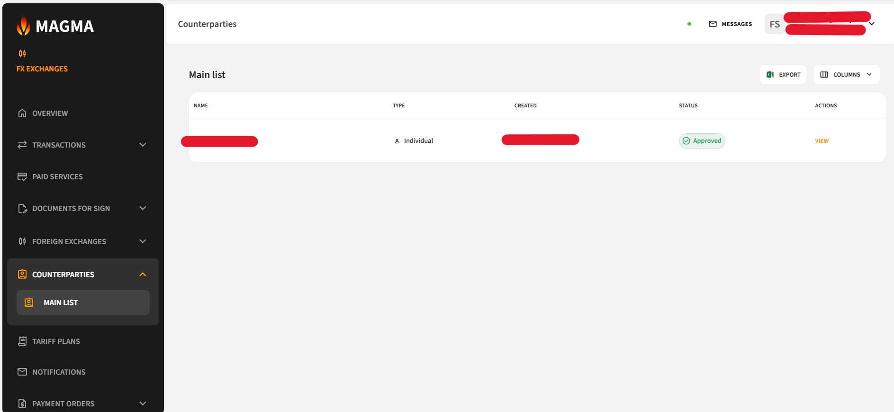
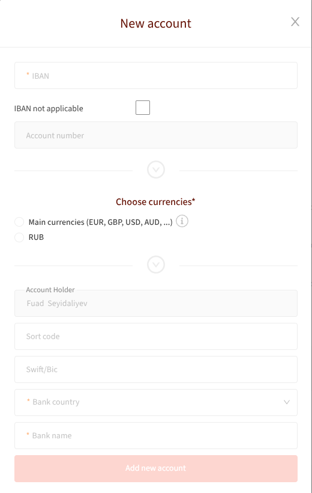
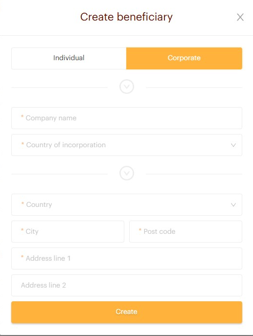
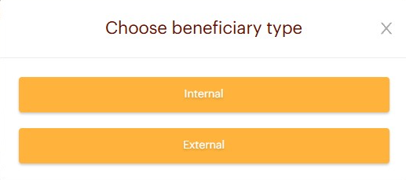
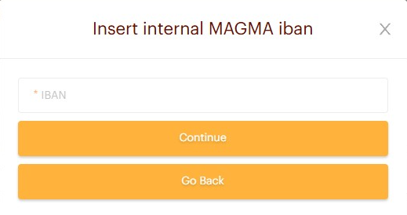
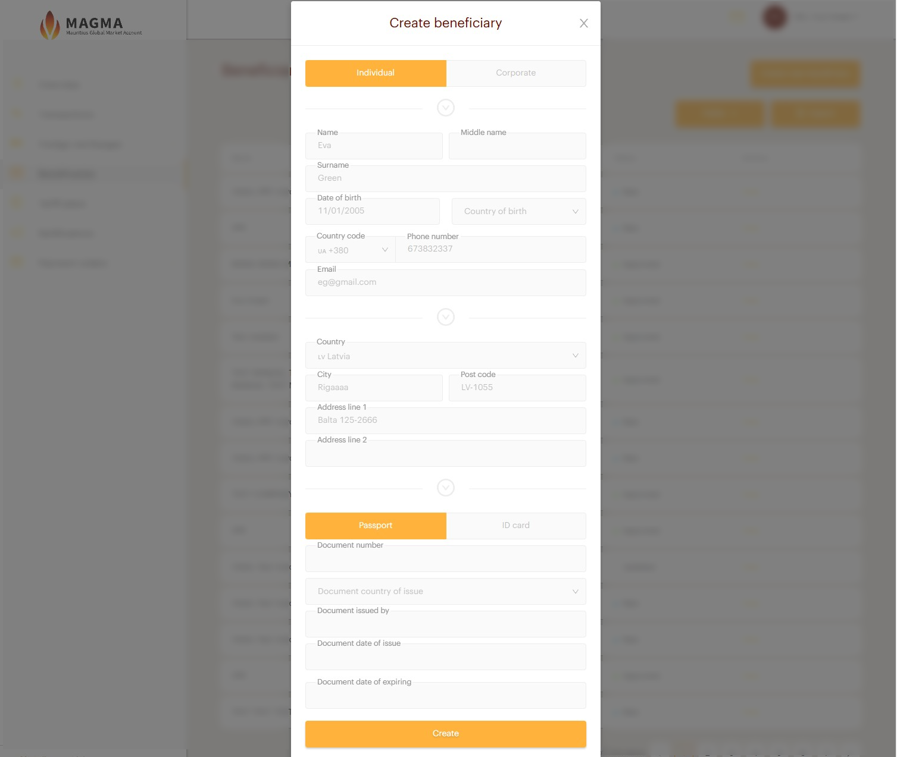
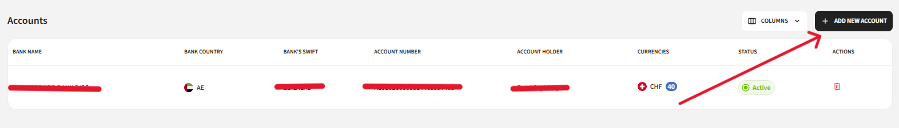
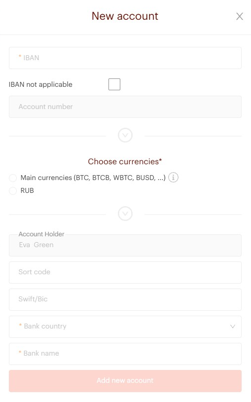
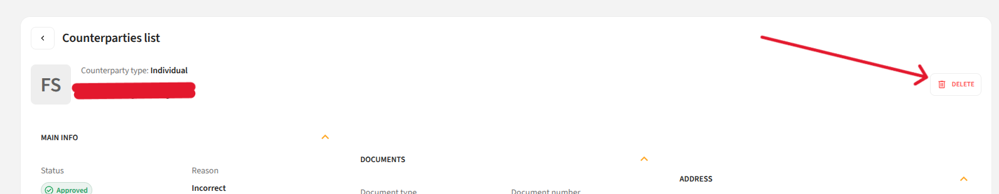

# Counterparties

The **Counterparties** page contains information about all your registered counterparties, sorted by date — newest to oldest.

## Counterparty Information

| Column | Description |
|---|---|
| **Name** | Counterparty name |
| **Type** | Individual or Corporate |
| **Created** | Registration date |
| **Status** | Current review stage |

## Counterparty Statuses

| Status | Description |
|---|---|
| **New** | Just created, awaiting review |
| **Updated** | Updated by client, awaiting re-review |
| **Rejected** | Creation rejected |
| **Approved** | Confirmed and ready for payments |
| **Deleted** | Deleted by client |
| **Returned to Adjustment** | Returned for corrections |

---

## Create New Counterparty

Both **Individual** and **Corporate** counterparties can be registered. Depending on the type, different fields are required.

### Individual External Counterparty

1. Click **"Create new counterparty"**
2. Fill in the following fields:

   **Personal details:**
   - **Name** *(required)*
   - **Middle name** *(optional)*
   - **Surname** *(required)*
   - **Date of birth** *(optional)*
   - **Country of birth** *(optional)*
   - **Country code** *(optional)*
   - **Phone number** *(optional)*
   - **Email** *(optional)*
   - **Country** *(required)*
   - **City** *(required)*
   - **Post code** *(required)*
   - **Address line 1** *(required)*
   - **Address line 2** *(optional)*

3. Select **document type** — Passport or ID

   **Document details:**
   - **Document number** *(required)*
   - **Document country of issue** *(required)*
   - **Document issued by** *(required)*
   - **Document date of issue** *(required)*
   - **Document date of expiry** *(optional)*

4. Click **"Create"**

---

### Corporate External Counterparty

1. Click **"Create new counterparty"**
2. Select counterparty type — **Corporate**
3. Fill in the following fields:
   - **Company name** *(required)*
   - **Registration number** *(required)*
   - **Email** *(optional)*
   - **Country of incorporation** *(required)*
   - **Date of registration** *(required)*
   - **Country** *(required)*
   - **City** *(required)*
   - **Post code** *(required)*
   - **Address** *(required)*
4. Click **"Create"**

---

### Internal Counterparty

An internal counterparty is another client already registered on the MAGMA platform.

1. Click the **"Internal"** button in the counterparty type list

2. Enter the counterparty's **IBAN**

3. All counterparty information will be pulled up automatically
4. Click **"Confirm"** to complete

> **Note:** The counterparty must already be registered on the MAGMA platform.

---

## Add a New Counterparty Account

A new account can only be added for an **Approved** counterparty.

1. Select an **Approved** counterparty and click **"View"**
2. Click **"Add new account"**

3. Fill in the following fields:
   - **IBAN** *(required, or tick "IBAN not applicable")*
   - **Account number** *(optional)*
   - **Currency** *(required)*
   - **Sort code** *(optional)*
   - **Swift/BIC** — filled in automatically after entering IBAN
   - **Bank country** — filled in automatically after entering IBAN
   - **Bank name** — filled in automatically after entering IBAN
4. Click **"Add new account"**

---

## Delete a Counterparty

A counterparty can be deleted at any time — before or after approval.

1. Select **"Delete counterparty"** from the actions menu

2. Confirm by answering **"Are you sure you want to delete this counterparty?"**
