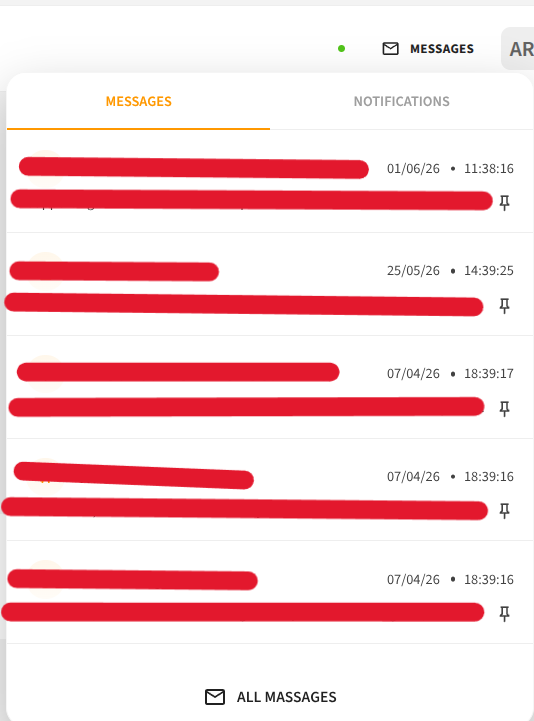
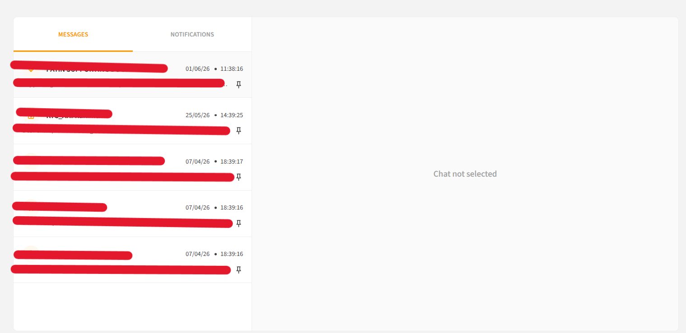
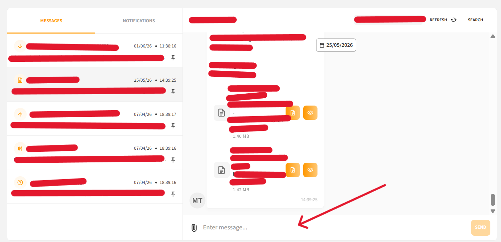

# Messages

The **Messages** section allows you to communicate with the bank. You can receive and respond to messages — however, new conversations cannot be initiated by the client.

## Unread Messages

When a new message is received:

- The number of **unread messages** is displayed on the Messages icon
- An **email notification** is also sent

## Message List

To open the full list of messages, click the **"All messages"** button.

Messages are sorted by **Last updated** date — newest to oldest.

## Replying to a Message

To reply to a message:

1. Click on the message to open it
2. Type your response
3. Attach documents if needed
4. Send your reply

> **Note:** Replies can include both text and documents.
