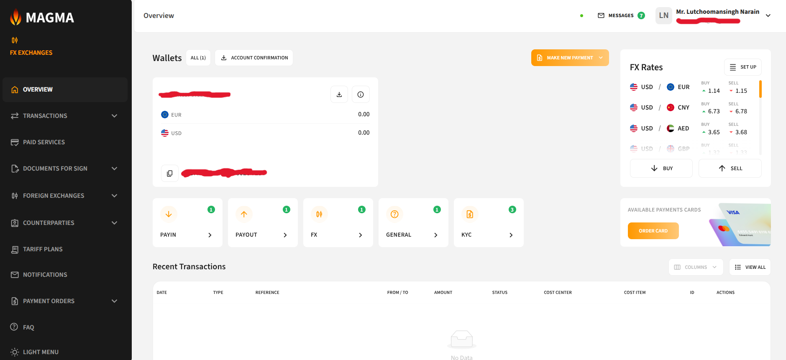

# Overview

The **Overview** page is the main dashboard of your MAGMA account. It provides a summary of your account and quick access to key functions.

## What You Can See

- **Account number** — your unique account identifier
- **Balance** — total amount of funds in each currency
- **Recent Transactions** — a list of your latest transactions
- **Make a new payment** — quick access to create a new payment

## Balance

Displays the available funds across all your wallets, grouped by currency.

## Recent Transactions

Shows the most recent activity on your account. For a full transaction history, go to the [Transactions](transactions.md) section.

## Make a New Payment

Click the **"Make a new payment"** button to initiate a new payment directly from the Overview page. For detailed payment instructions, see the [Transactions](transactions.md) section.
