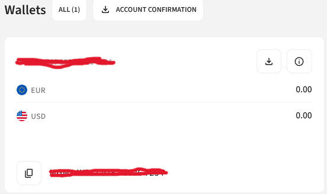
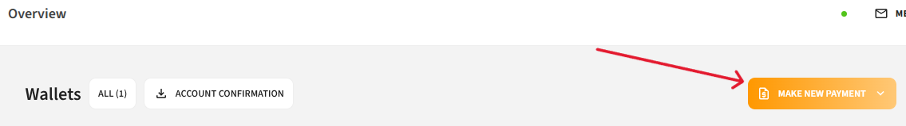
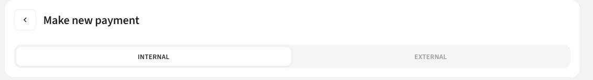
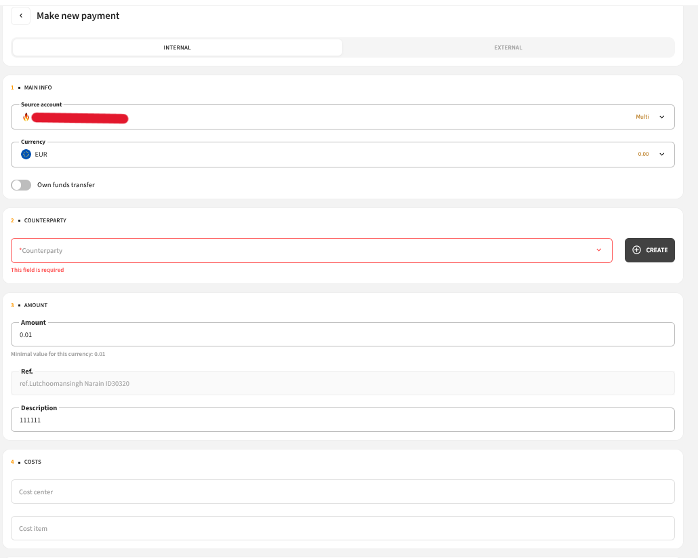
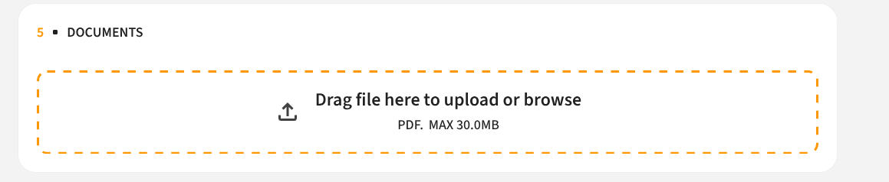
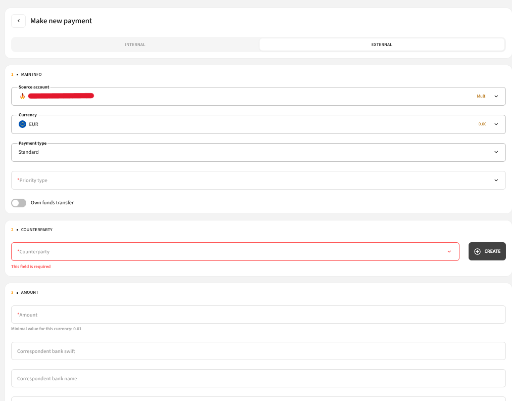
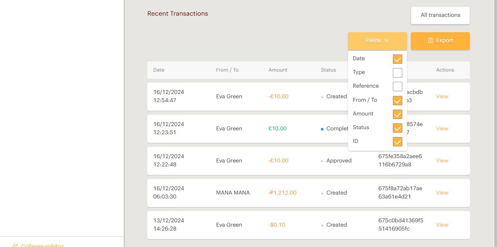

# Overview

The **Overview** page is the main dashboard of your MAGMA account. It provides a summary of your account and quick access to key functions.

---

## Balance

The **balance** displayed is the current (quick) balance — the total amount of money in your account that is available for payments. It excludes pending transactions and held amounts.

> Always use the current balance to determine how much money is available for use.

All accounts are **multi-currency** — balances are displayed separately for each currency.

### Copy Balance

To copy your balance, click the **"Copy balance"** icon next to the account you need.

---

## Make a New Payment

To make a new payment:

**Step 1** — Click **"Make new payment"**

**Step 2** — Choose the payment type:

### For Internal Payment

1. Select **source account**
2. Select **currency**
3. Select **payment type**
4. Select **counterparty**
5. Select **counterparty account**
6. Enter **amount**
7. Enter **description**
8. Upload **transaction support document** (multiple documents allowed; documents can also be deleted)

### For External Payment

1. Select **source account**
2. Select **currency**
3. Select **payment type**
4. Select **counterparty**
5. Select **counterparty account**
6. Enter **amount**
7. Enter **Correspondent bank name**
8. Enter **Correspondent SWIFT**
9. Enter **Correspondent Bank Account**
10. For **RUB currency** — enter **Code VO** (additional field)
11. Enter **description**
12. Upload **transaction support document** (multiple documents allowed; documents can also be deleted)

> **Note:** Payment can only be made to an **approved counterparty**. See how to add a new counterparty in the [Counterparties](counterparties.md) section.

> If the counterparty is approved but does not have an account, select the **"+"** button and follow the instructions in [Add a New Counterparty Account](counterparties.md#add-a-new-counterparty-account).

---

## Recent Transactions

The **Recent Transactions** section shows the last **5 transactions** on your account.

Transactions are sorted by date — newest to oldest.

| Column | Description |
|---|---|
| **Date** | The date the payment was made |
| **Type** | Transaction type (Payin, Payout, Fee) |
| **Reference** | Payment description |
| **From/To** | Payment payee or payer |
| **Amount** | Transaction amount |
| **Status** | Transaction status (Created, Approved, Declined) |
| **ID** | Unique transaction ID |

### Actions

- Click **"All transactions"** to go to the full [Transactions](transactions.md) page
- Use the **"Fields"** button to show or hide columns
- Click **"Export"** to download your transactions
