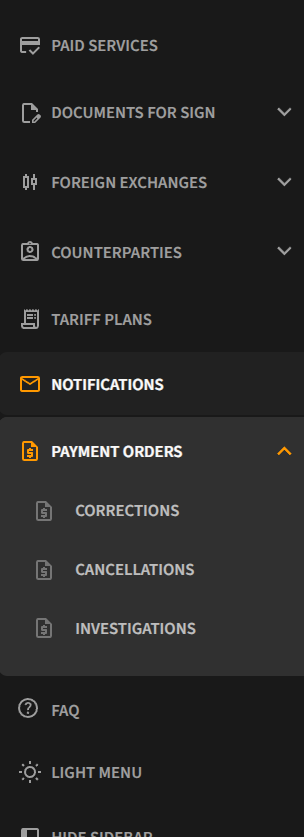
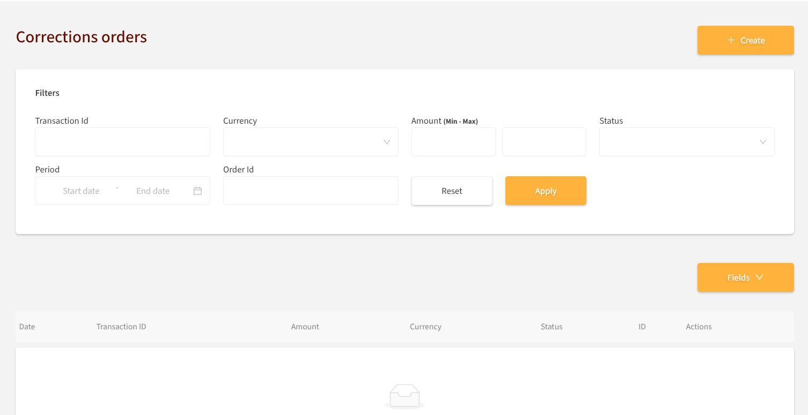
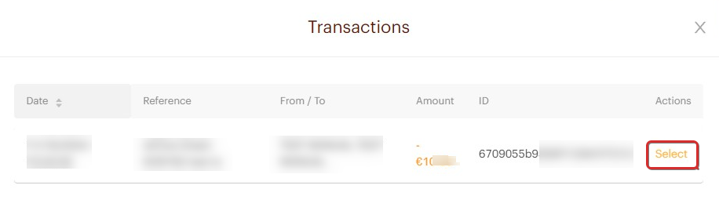
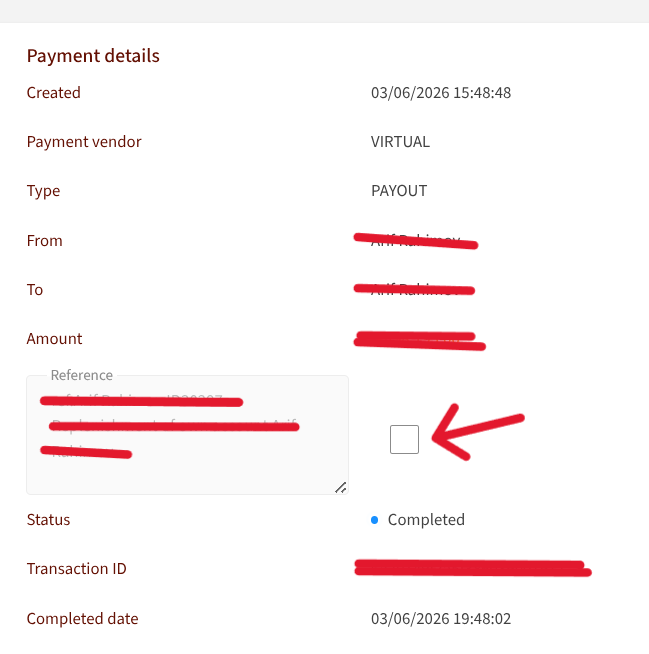
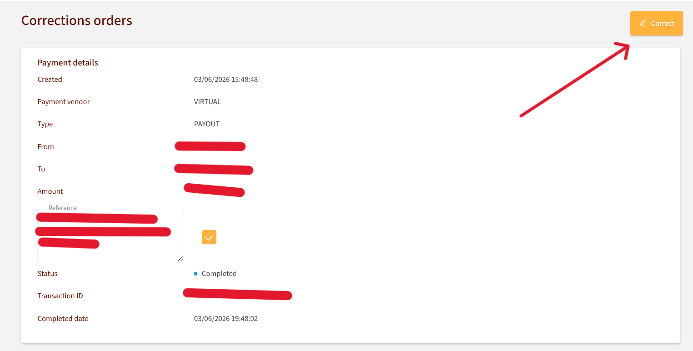
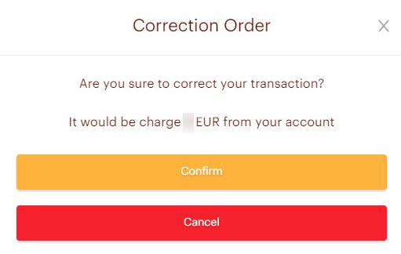
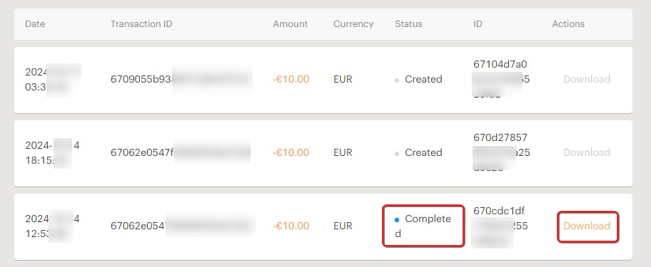

# Payment Orders

The **Payment Orders** section allows you to submit three types of orders for your completed transactions.

## Order Types

- **Correction Order** — request a correction to a transaction's details
- **Cancellation Order** — request to cancel a transaction
- **Investigation Order** — request an investigation into a transaction

---

## Correction Order

The **Correction Order** subsection contains:

- A **"+ Create"** button for creating a new order
- **Filter fields** to search existing orders
- A **list of your previous orders** by transaction

### How to Create a Correction Order

1. Click **"+ Create"**
2. Select the transaction for which you want to make a correction

3. The fields available for correction will be highlighted
4. Click the **checkbox** next to a field to enable editing, then make your changes

5. Review all changes and click **"Correct"**
6. Confirm your order — a fee will be charged according to your tariff plan

7. Your order will be added to the list where you can:
   - View its **status**
   - **Download** a result document (if available)

---

## Cancellation Order

To create a cancellation order:

1. Click **"+ Create"**
2. Select the transaction you want to cancel from the list
3. Confirm your action

---

## Investigation Order

To create an investigation order:

1. Click **"+ Create"**
2. Select the transaction you want investigated from the list
3. Confirm your action
