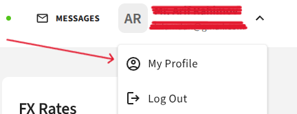
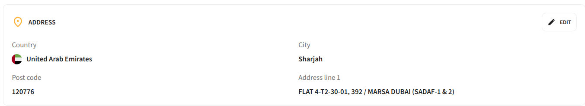
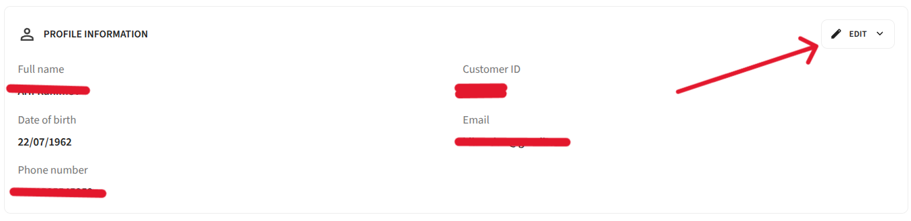
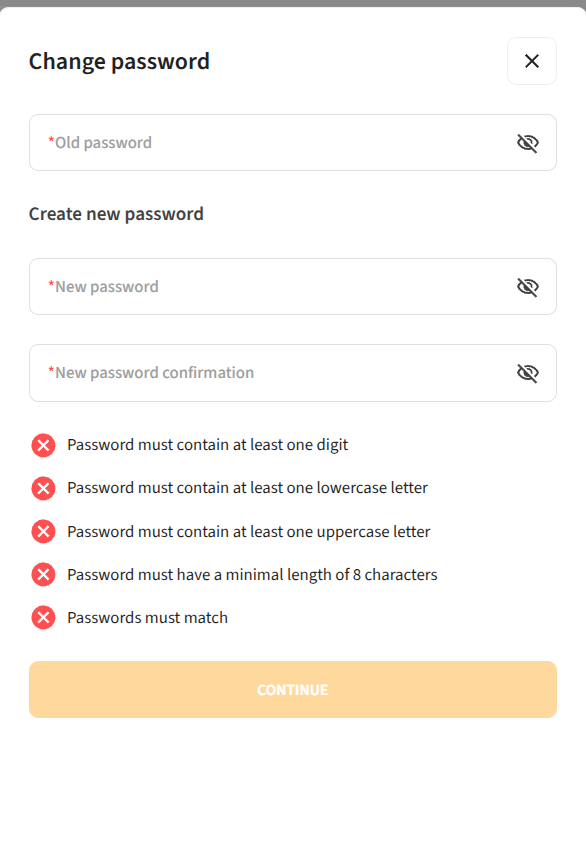

# Personal Profile

Each customer has a personal profile available. To open it, select the **down arrow icon** in the upper menu.

---

## Personal Information

The **Personal Information** section contains the main details about the company's contact person:

| Field | Editable |
|---|---|
| **Full name** | No |
| **Date of birth** | No |
| **Actual address** | Yes |
| **Phone number** | Yes |
| **Email address** | Yes |
| **Customer ID** | No |

---

## Actual Address Change

To change your address:

1. On the **Personal Profile** page, click the **pencil icon** next to the **"Actual address"** field
2. Enter the new address
3. Click **"Continue"**

> **Note:** Changes will be saved after review and approval by the compliance team. You will receive an email notification upon successful address change.

---

## Phone Number and Email Change

To change your phone number:

1. Click the **pencil icon** next to the **"Phone number"** field
2. Enter the new country code and phone number *(must be unique)*
3. Enter your **system password**
4. Click **"Continue"**
5. Enter the **4-digit confirmation code** sent to the new phone number
6. Click **"Continue"**

> You will receive an email notification upon successful change.

To change your **email address**, follow the same steps using the pencil icon next to the **"Email address"** field.

---

## Password Change

To change your password:

1. In the **"Change password"** section, enter your **current password**
2. Enter the **new password**
3. **Repeat** the new password

> **Note:** The password must meet all security requirements.

4. Click **"Continue"**
5. Enter the **4-digit confirmation code** sent to your mobile device
6. Click **"Continue"**

You will receive a notification confirming the password has been successfully changed.
