# Registration

To register in the system, you must create an account by performing the following steps:

1. Open [https://ib.magma.mu/](https://ib.magma.mu/) in your browser

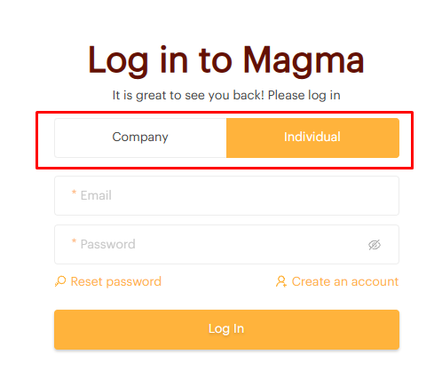

2. Select the type of customer — **Individual** or **Company**

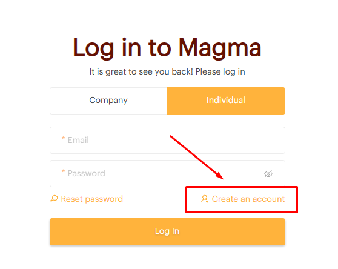

3. Select **"Create an account"**

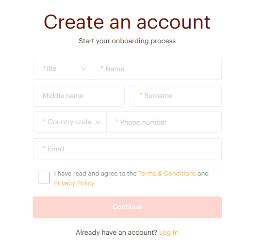

4. Enter the required information

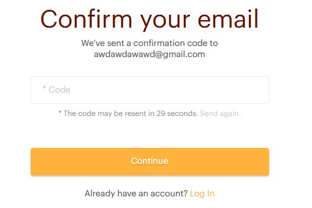

5. Enter the confirmation code sent to your email (6-digit verification code)

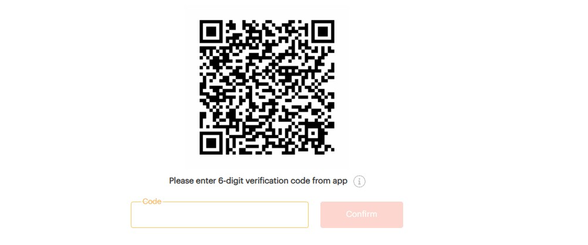

6. Scan the QR code via the **Google Authenticator** application:
   - For Android: [Google Play](https://play.google.com/store/apps/details?id=com.google.android.apps.authenticator2&hl=uk)
   - For iOS: [App Store](https://apps.apple.com/ru/app/google-authenticator/id388497605)

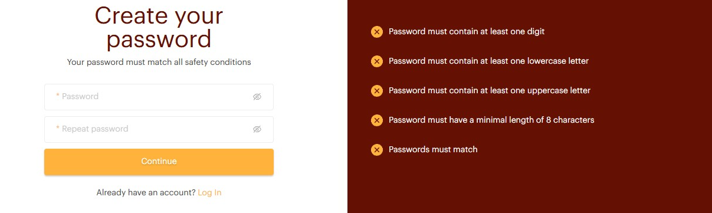

7. Enter the 6-digit code from the app

8. Create your password according to the rules

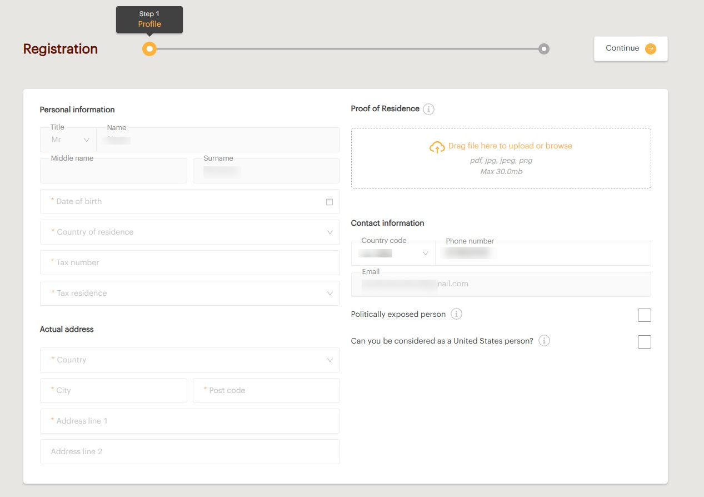

---

## Registration of an Individual

The registration process for an individual includes **2 steps**: Profile and Confirmation.

### Step 1 — Profile

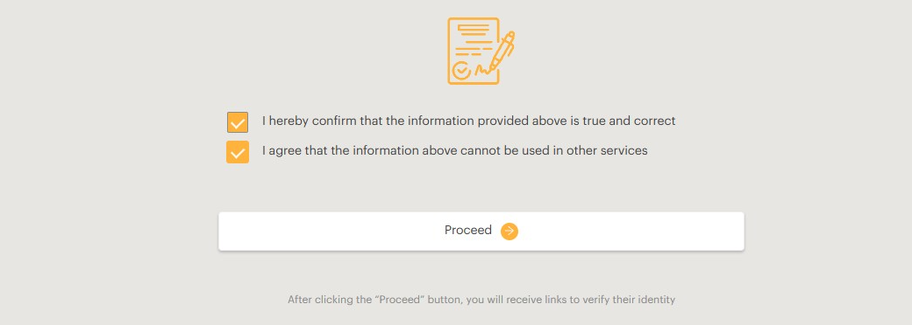

The **Profile** page is a registration form divided into 5 parts:

- **Personal information** — name and surname will be filled in from the previous steps; date of birth, country of residence, tax number, and tax residence must be entered.
- **Actual address** — the individual's actual address.
- **Proof of Residence** — required as proof of residence and must include full name, full address, date of issue, and name of the institution/authority that issued the document. The document must not be older than 3 months.
- **Contact information** — phone number and email will be filled in from the previous steps.
- **Additional information** — marks about politically exposed person and U.S. person.

### Step 2 — Confirmation

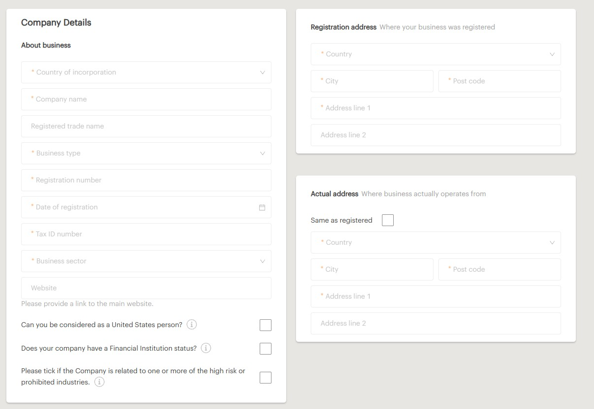

All entered information must be reviewed and necessary changes made by returning to the appropriate step using the **"Edit"** button.

After clicking **"Proceed"**, the information provided cannot be changed and the individual will receive a link to verify their identity.

To verify identity, follow the instructions provided. Once the verification is successfully completed and the registration information has been reviewed and approved, the account will be available for use — a confirmation email will be sent.

---

## Registration of a Company

The registration process for a company includes **5 steps**: Company profile, Business profile, Directors, Shareholders, and Confirmation.

### Step 1 — Company Profile

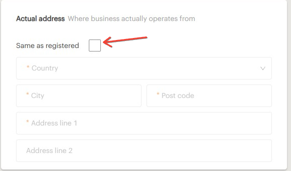

The **Company profile** page is a registration form divided into 4 parts:

- **Company details** — basic information about your business. If the country of incorporation is the United Kingdom, enter your company name and other information will be filled out automatically.
- **Registration address** — the address where the business was registered.
- **Actual address** — the address where the business operates. If the actual address is the same as the registered one, tick the **"Same as registered"** option.

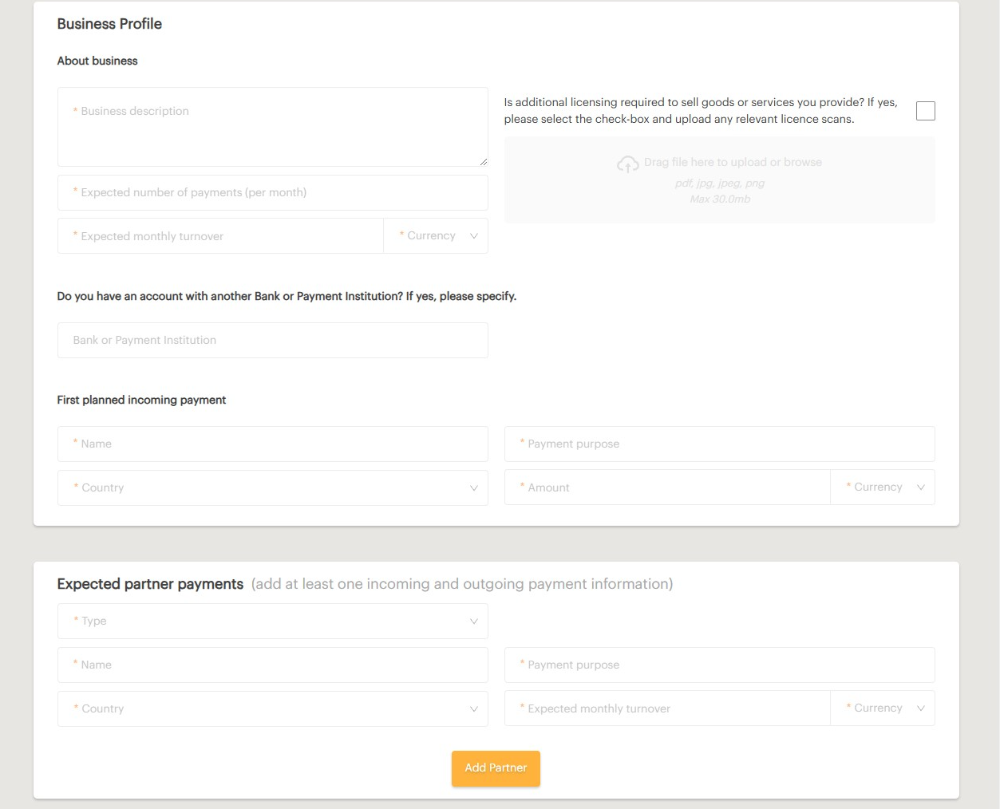

> **Note:** Additional hints will appear when you click the **"i"** icon.

When all required information is filled out, select **"Continue"** to proceed to Step 2.

### Step 2 — Business Profile

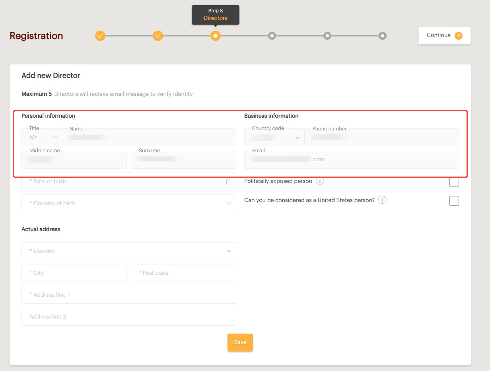

The **Business profile** page includes information about:

- Business description
- Servicing bank
- Incoming/outgoing payments
- Expected turnover

> **Note:** The business description field cannot be shorter than 70 characters.

> **Note:** You must add at least one incoming and one outgoing payment. Add all expected partner payments before selecting **"Continue"**.

### Step 3 — Directors

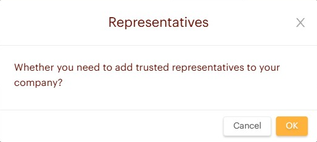

The **Directors** page is a registration form for adding directors — a maximum of 500 can be added. When registration is completed, all directors will receive an email to verify their identity.

> **Note:** Information highlighted in the form will be automatically pulled from Step 1 if you chose a director role during registration.

The registration form consists of the following sections:

- **Personal information** — name and surname (pre-filled), date of birth, and country of birth.
- **Actual address** — director's actual address.
- **Proof of Residence** — must include full name, full address, date of issue, and name of the issuing institution. The document must not be older than 3 months.
- **Business information** — phone number and email (pre-filled).

When all required information is filled out, select **"Save"** and add a new director if necessary. Select **"Continue"** only when all directors have been added.

### Adding Representatives (Optional)

If you want to add a representative, click **OK** and fill in all required fields. You can add several representatives.

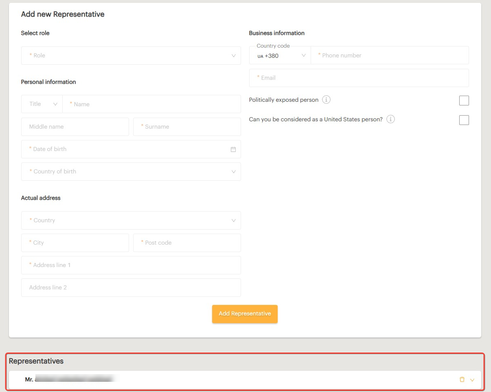

### Step 4 — Shareholders

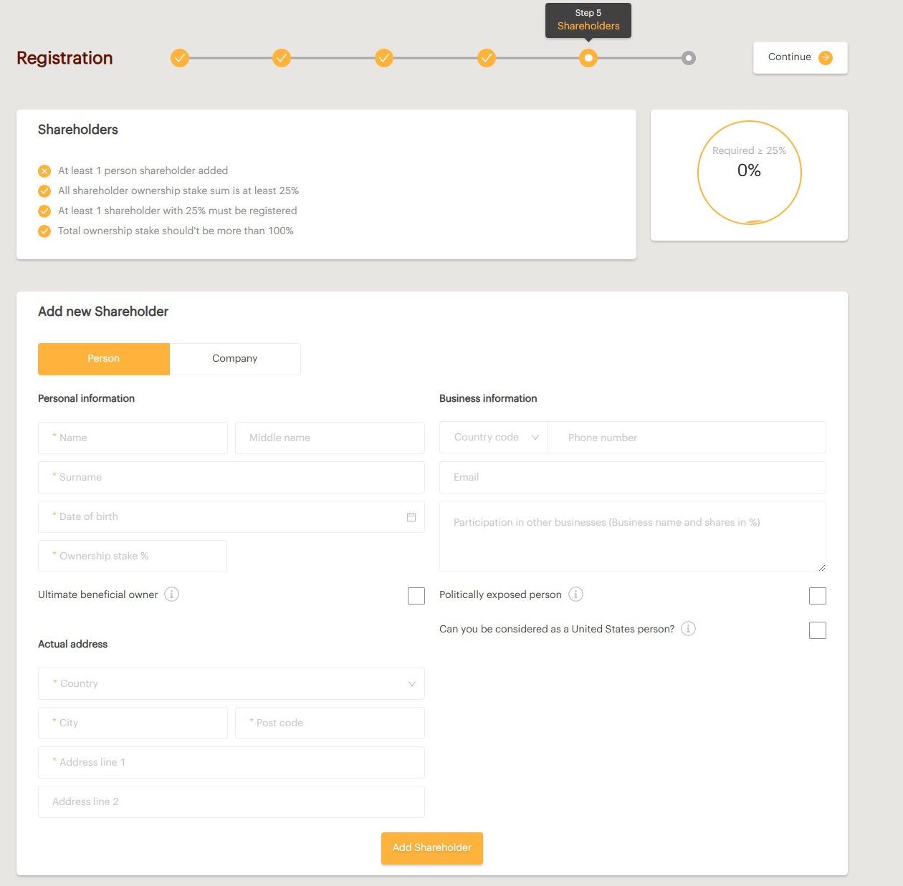

The **Shareholders** page is a registration form for adding shareholders.

**Requirements:**

- At least **1 private shareholder** must be added
- All shareholder ownership stakes must sum to **no more than 100%** but **no less than 25%**
- At least one shareholder must hold an ownership stake of **25% or more**
- Each shareholder ownership must be **greater than 0** and rounded to two digits

**Shareholder registration form — Person:**

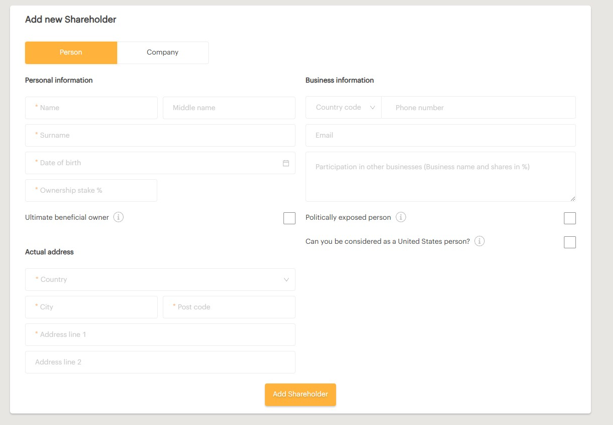

- **Personal information** — name, surname, date of birth, and country of birth.
- **Actual address** — shareholder's actual address.
- **Documents** — proof of identity (valid ID or passport) and proof of residence (not older than 3 months).
- **Business information** — phone number and email (optional).

**Shareholder registration form — Company:**

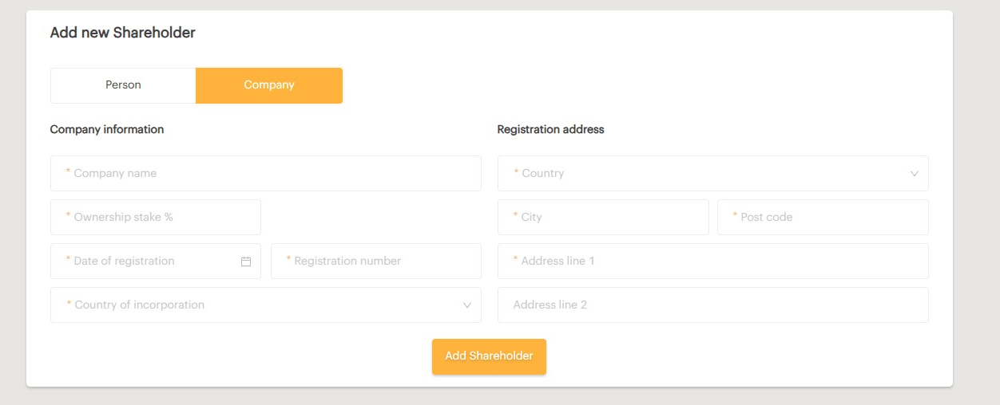

- **Company information** — company registration information and ownership stake.
- **Registration address** — the address where the business was registered.

When all required information is filled out, select **"Add Shareholder"** and add new shareholders if necessary. Select **"Continue"** only when all shareholders have been added.

### Step 5 — Confirmation

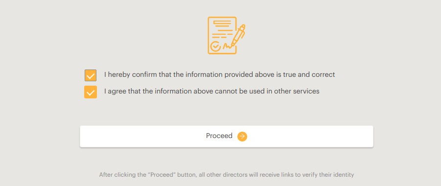

All entered information must be reviewed and necessary changes made by:

- Selecting the **"Edit"** button, or
- Clicking on the appropriate step

After clicking **"Proceed"**, the information provided cannot be changed and all directors will receive links to verify their identity.

To verify identity, follow the instructions provided. Once the verification is successfully completed and the registration information has been reviewed and approved, the account will be available for use — a confirmation email will be sent.
