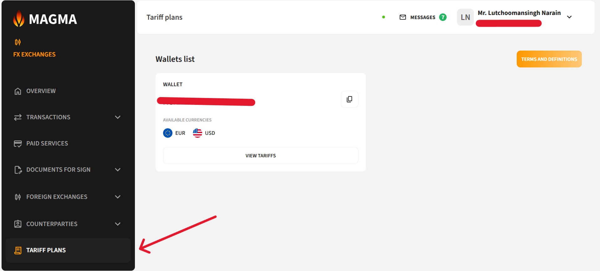
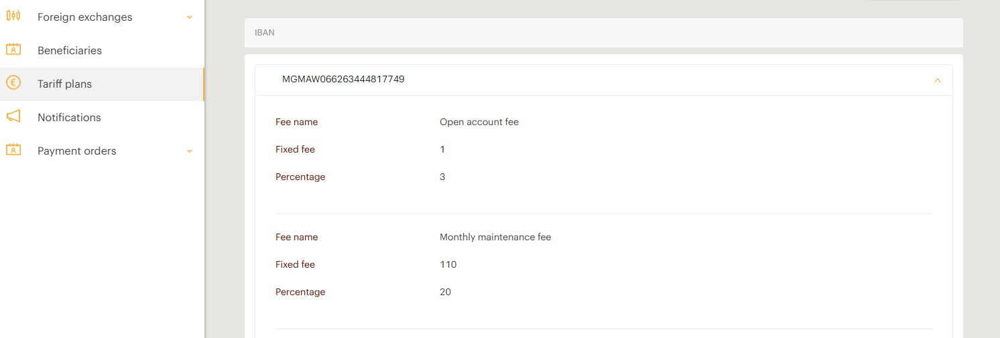

# Tariff Plans

The **Tariff Plans** section allows you to view all the fees and tariffs applied to your accounts.

## How to View Your Tariff Plan

1. Go to the **Tariff Plans** section
2. Select your account and click the tariff icon

> **Note:** If the account is greyed out, a tariff plan has not yet been connected to it.

3. A complete list of your tariff plan details will be displayed

