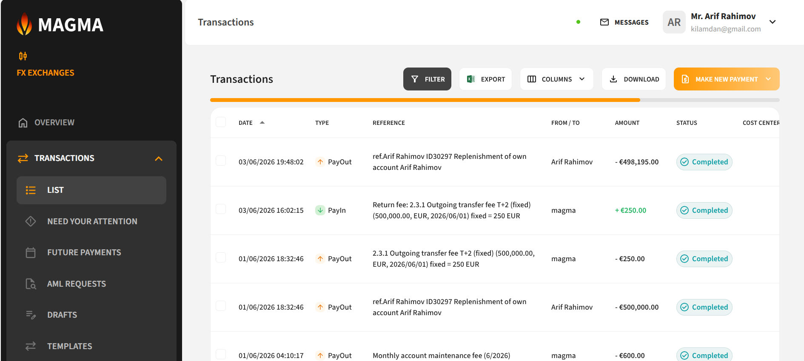
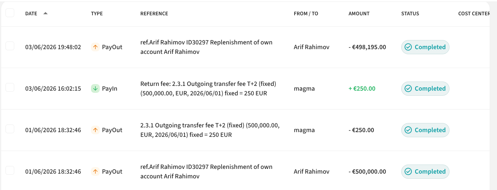
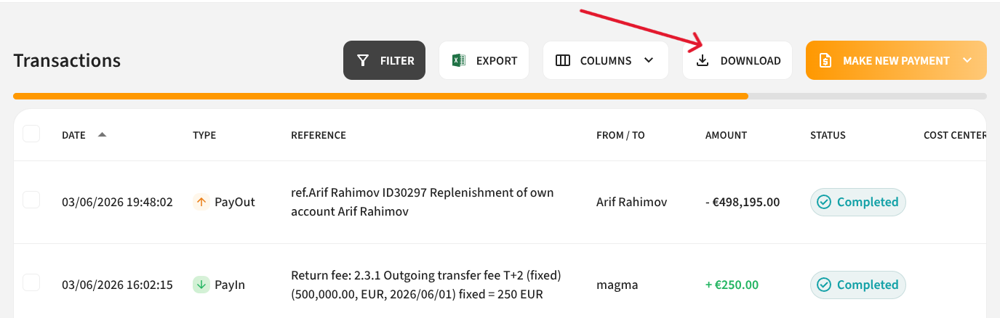
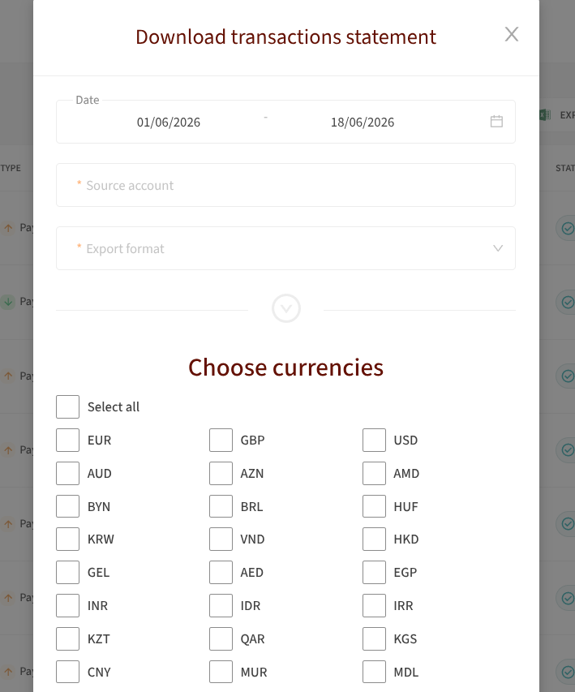
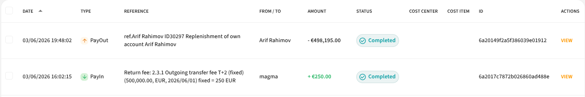
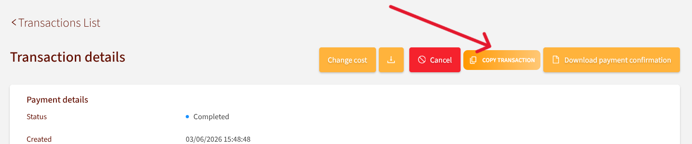

# Transactions

The **Transactions** page contains all information about your transactions.

---

## Search Using Filters

To find a specific transaction, use the following filter fields:

| Filter | Description |
|---|---|
| **Transaction ID** | Unique transaction identifier |
| **Currency** | Transaction currency |
| **Type** | Transaction type |
| **Status** | Current stage of the payment |
| **Amount** | Transaction amount |
| **Counterparty** | Name of the counterparty |
| **Reference** | Payment description/details |
| **Period** | Date range |
| **Wallets** | Specific wallet |

**Transaction Statuses:**

- **Completed** — payment successfully submitted
- **Declined** — payment rejected
- **Created** — new payment waiting for review

You can combine multiple filters to narrow your search. Click **"Apply"** to apply the selected filters.

---

## Make a New Payment

To make a new payment from the Transactions page, follow the steps described in the [Overview → Make a New Payment](overview.md#make-a-new-payment) section.

---

## Transaction Details

To view transaction details, click the **"View"** button next to the transaction.

The transaction details can be **downloaded and saved as a PDF** document.

---

## Statement

To create an account statement:

1. Click the **"Download"** button
2. Fill in the following fields:
   - **Date** — statement period
   - **Source account** — account number for which the statement should be prepared
   - **Export format** — Excel or PDF
3. Click **"Download"**

> **Note:** The balance on the statement may differ from the **Quick balance**. The statement balance reflects only completed transactions, while the current balance includes all funds available for payments (excluding pending transactions and holds).

---

## Copy Transaction

To repeat a previous payment:

1. Click **"View"** on the desired transaction
2. Click **"Copy this transaction"**

A new transaction will be created with all fields pre-filled from the previous payment. You can then review and submit it following the standard payment process.
