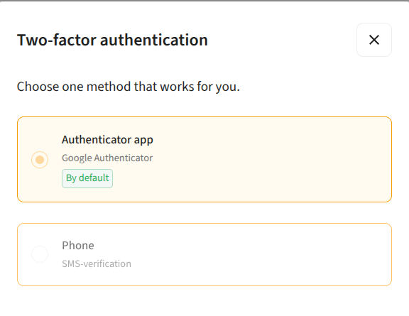
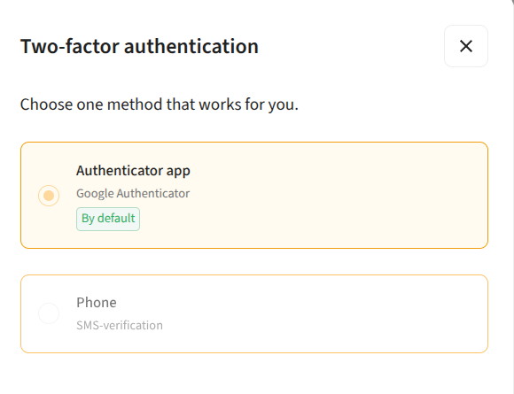
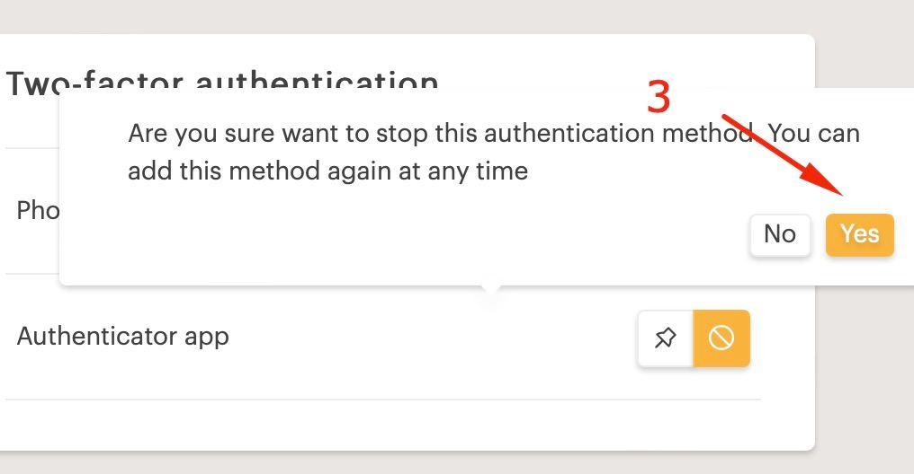
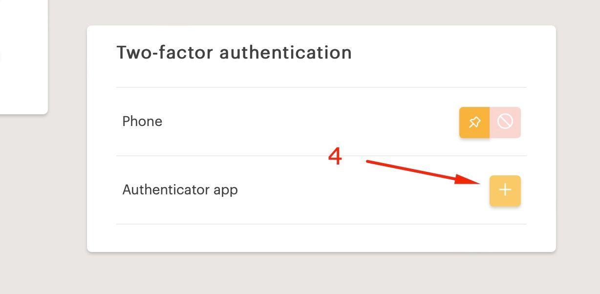
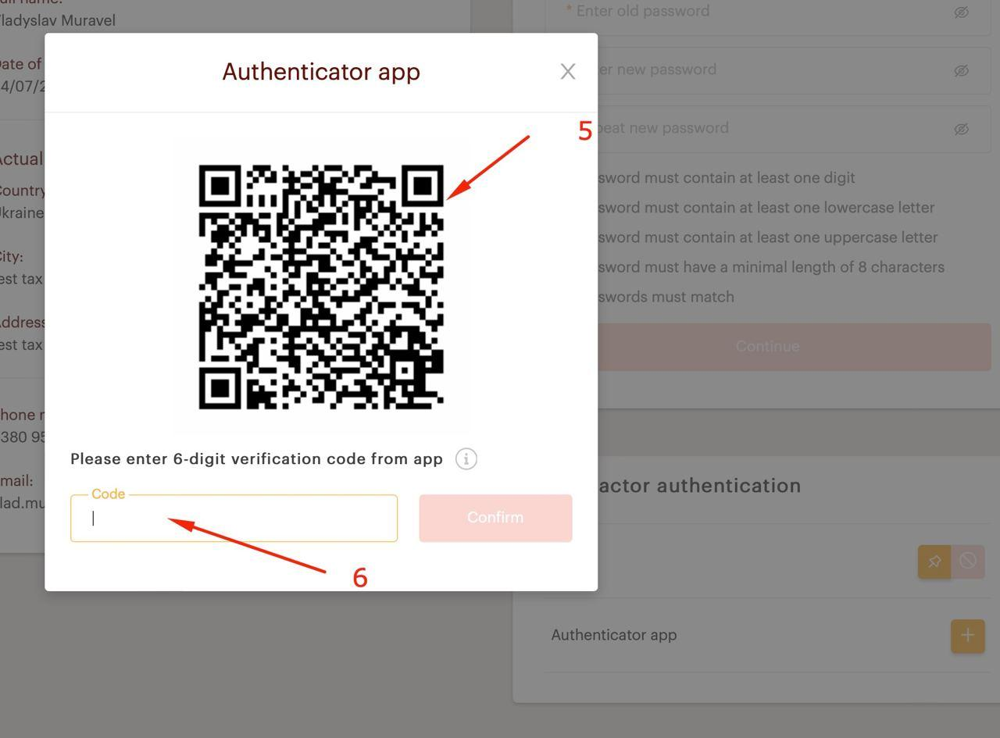

# Two-Factor Authentication

The standard authentication method in MAGMA is an **authenticator application**, added during account registration.

> **Note:** If you lose access to your authenticator, please contact your manager and then follow the steps in [Changing Authentication Method](#changing-authentication-method) below.

---

## Authenticator App

To set up the Authenticator app:

1. Download an authenticator app on your smart device:
   - **Android:** [Google Authenticator on Google Play](https://play.google.com/store/apps/details?id=com.google.android.apps.authenticator2&hl=uk)
   - **iOS:** [Google Authenticator on App Store](https://apps.apple.com/ru/app/google-authenticator/id388497605)

2. Click the **"Authenticator app"** button — a QR code will be displayed

3. Open your authenticator app and **scan the QR code**
4. Enter the **confirmation code** from the app in the field shown below the QR code

5. Click **"Confirm"**

---

## Changing Authentication Method

To change your authentication method, go to **Personal Profile → Two-Factor Authentication**.

**Step 1** — Select **phone number** as the priority method

**Step 2** — Click **"Delete Google Auth method"**

**Step 3** — Confirm the deletion

**Step 4** — After deletion, click the **"Add new Google Auth"** icon

**Step 5** — Scan the QR code using your Google Authenticator app:
   - **Android:** [Google Play](https://play.google.com/store/apps/details?id=com.google.android.apps.authenticator2&hl=uk)
   - **iOS:** [App Store](https://apps.apple.com/ru/app/google-authenticator/id388497605)

**Step 6** — Enter the **6-digit code** from the app to confirm
